

  

###

The Event Management System is a web-based application developed to simplify the process of event booking and management. It allows customers to browse event services, customize bookings with decorations and optional items, view pricing details, and confirm bookings. Admins can efficiently manage customers, bookings, and decoration pricing.  This project was developed as part of my college academic project and to enhance practical development skills for job preparation.

###

<h2 align="left">🚀 Features Overview</h2>

###

➺ User-friendly event booking system ➺ Dynamic price calculation ➺ Separate Customer and Admin modules ➺ Secure login and session handling ➺ Admin management dashboard

###

<h2 align="left">💻Technologies used:</h2>

###

  
  
  
  
  
  
  
  
  

###

<h4 align="left">Server : XAMPP (Apache + MySQL)</h4>

###

<h2 align="left">🗄️ Database Configuration</h2>

###

db_connect.php  This file handles the database connection between the application and MySQL. ➝ Uses mysqli_connect ➝ Centralized DB connection ➝ Included in all backend files ➝ No UI / page output  include 'db_connect.php';

###

<h2 align="left">🏠 Home Page</h2>

###

The home page is the landing page of the system.  ➜ 𝐍𝐚𝐯𝐢𝐠𝐚𝐭𝐢𝐨𝐧 𝐛𝐚𝐫: Home, About Us, Book Event, Contact, Login (dropdown with Customer Login & Admin Login).  ➜ Automatic image slider showcasing events.  ➜ About Us section describing Suma Events.  ➜ Events section displaying all event types: ↳ Clicking an event redirects to Book Event page if logged in. ↳ If not logged in, the user is prompted to login first.  ➺ Contact section with address, email, and phone number.

###

<!-- 

 -->
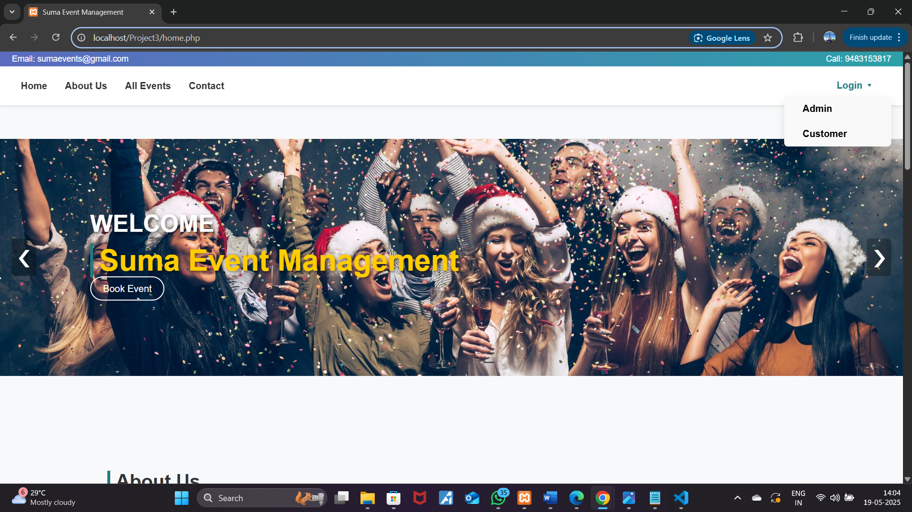 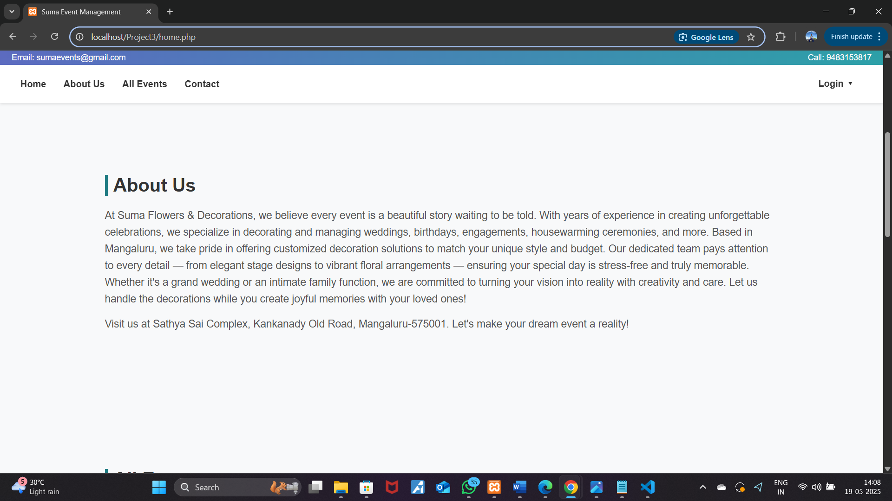 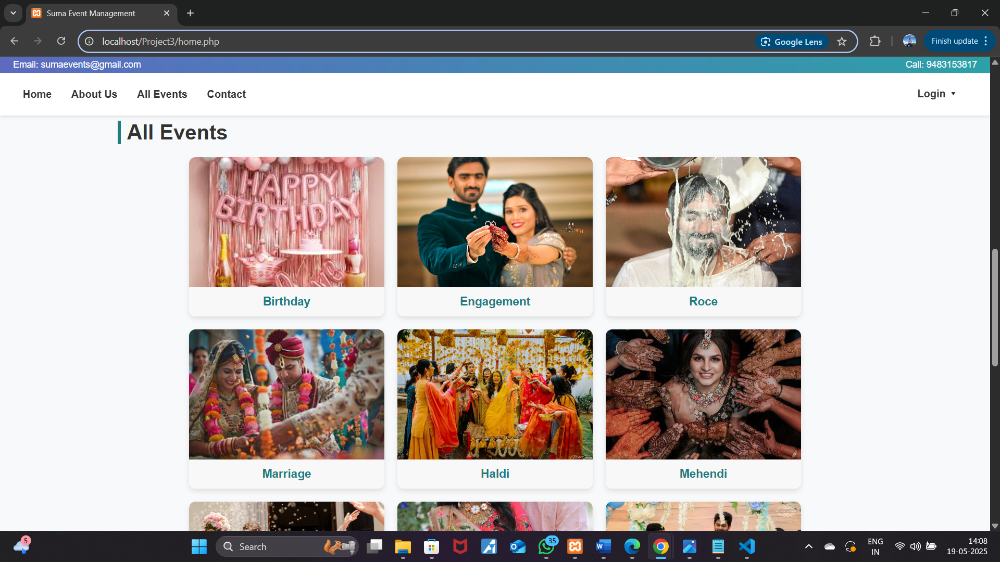 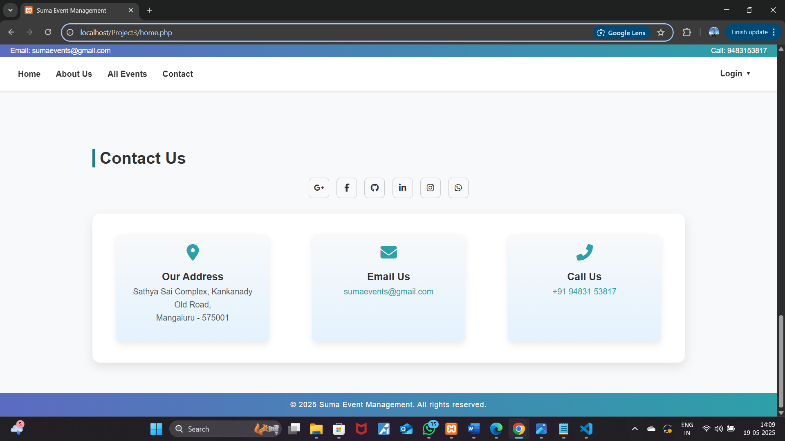

###

<h2 align="left">🔐 Login Page</h2>

###

➜ Customers can register or login. ➜ Form validation ensures correct input. ➜ Secure sessions store user data.  ➜ After login: ↳ Redirects to home.php ↳ Navbar shows "Hi, [Username]" ↳ Dropdown options: Dashboard, My Bookings, Profile, Logout

###

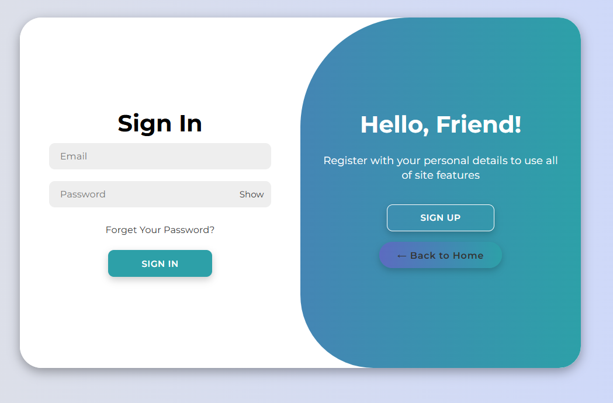 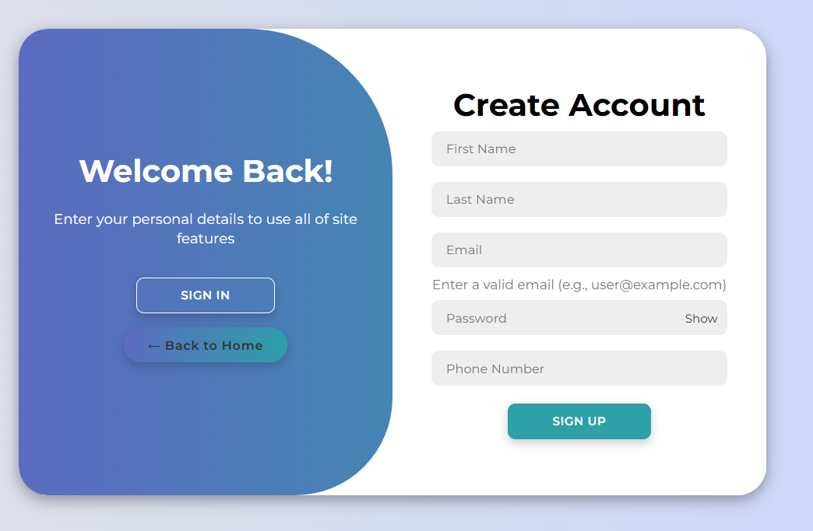

###

<h2 align="left">👤 Customer Dashboard</h2>

###

Redirected here after login.  ➜ Overview: Shows upcoming bookings and past events. ➜ Navigation: Home, Book Event, My Bookings, Profile, Logout ➜ Quick Actions: Option to book a new event directly from the dashboard.

###

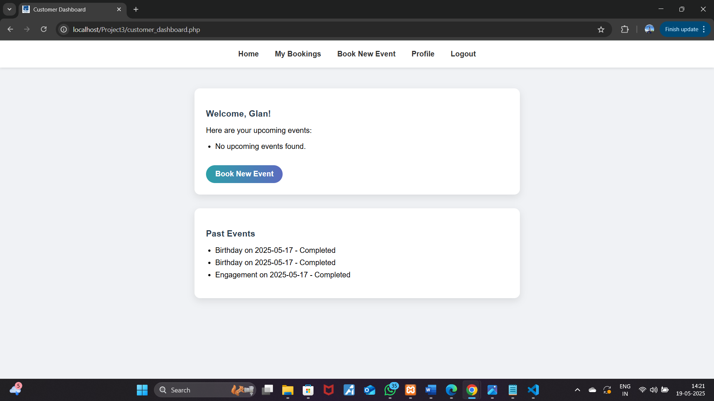

###

<h2 align="left">📅 Book Event Page</h2>

###

➜ Core booking functionality of the system.  ➜ Event selection: Date, time, and time period ↳ Time restriction: 06:00 AM – 10:00 PM ↳ Daily booking limit: Maximum 3 bookings per day  ➜ Event type selection: Displays related decorations with prices.  ➜ Decoration selection: Choose decorations based on event type.  ➜ Optional items: Chairs, Shamiyana, Speaker, Lighting  ➜ Dynamic price calculation based on selected items and quantity.  ➜ Address field for event location.  ➜ Total amount displayed before proceeding.

###

![Book Event](Screenshots/Book_event1.png

###

<h2 align="left">👤 Customer Profile</h2>

###

Allows customers to view their personal profile details.

###

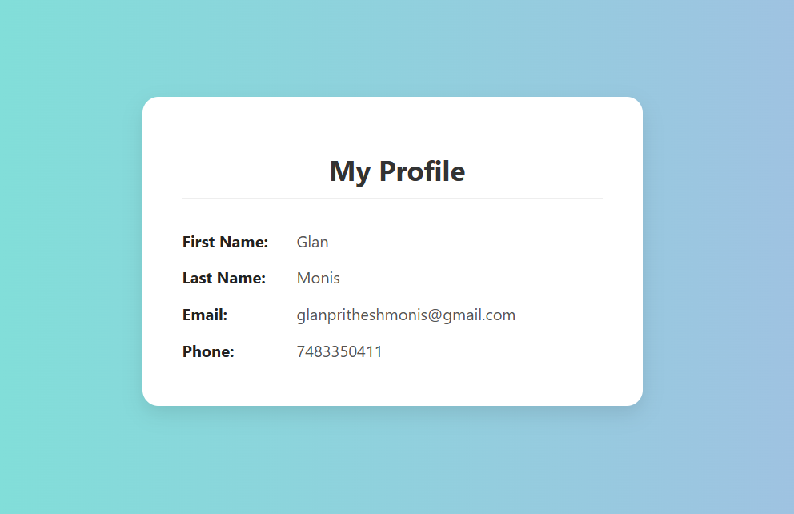

###

<h2 align="left">🔐 Admin Login</h2>

###

➜ Provides a secure login for admin users. ➜ Accessible from the Login dropdown on the Home page. ➜ Uses username and password authentication. ➜ After successful login, the admin is redirected to the Admin Dashboard.

###

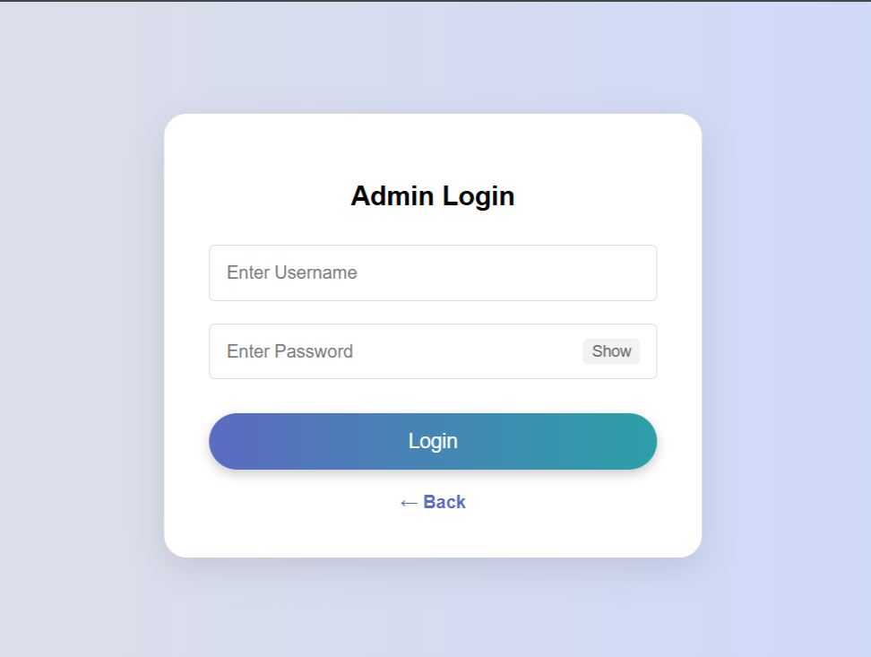

###

<h2 align="left">📊 Admin Dashboard</h2>

###

➜ Main control panel for the admin.  ➜ Top navigation bar includes: ↳ Manage Bookings ↳ Manage Decorations ↳ Customers ↳ Logout  ➜ Dashboard overview section displays: ↳ Total bookings ↳ Upcoming events ↳ Registered customers  ➜ Provides quick action buttons to: ↳ View all bookings ↳ Manage decorations ↳ View customer list

###

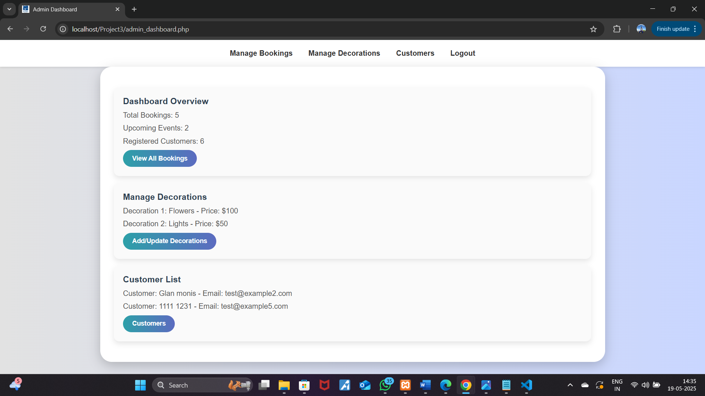

###

<h2 align="left">📦 Manage Bookings</h2>

###

➜ Allows the admin to view and manage all customer bookings. ➜ Navigation buttons: ↳ Back to Dashboard  ↳ Logout  ➜ 𝐁𝐨𝐨𝐤𝐢𝐧𝐠 𝐨𝐯𝐞𝐫𝐯𝐢𝐞𝐰: Categorized by Today’s bookings, Upcoming bookings, and Expired bookings.  ➜ Each booking displays: ↳ Customer name and details ↳ Event date & time ↳ Event type and extra decorations ↳ Total price and event address ↳ Action button to delete or modify bookings.

###

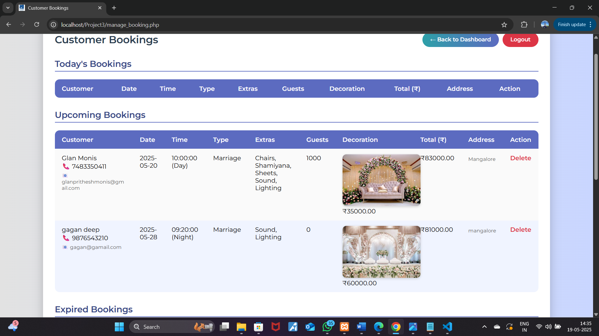

###

<h2 align="left">🎨 Manage Decorations</h2>

###

➜ Allows admin to Add, Update, or Delete decorations.  ➜ Add new decoration: ↳ Select Event Type from dropdown ↳ Upload Decoration image ↳ Enter Price and click Add Decoration  ➜ Manage existing decorations: ↳ View all decorations with images and prices ↳ Buttons to Update or Delete each decoration

###

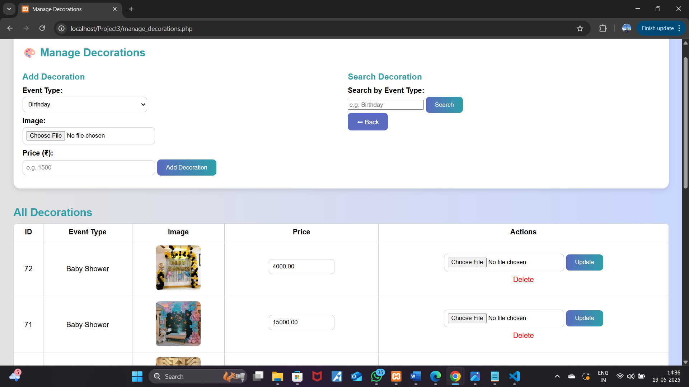

###

<h2 align="left">👥 Customer Details</h2>

###

➜ Allows admin to view all registered customers. ➜ Displays customer information:   ↳ Name   ↳ Email   ↳ Phone number ➜ Admin can also access each customer’s booking history.

###

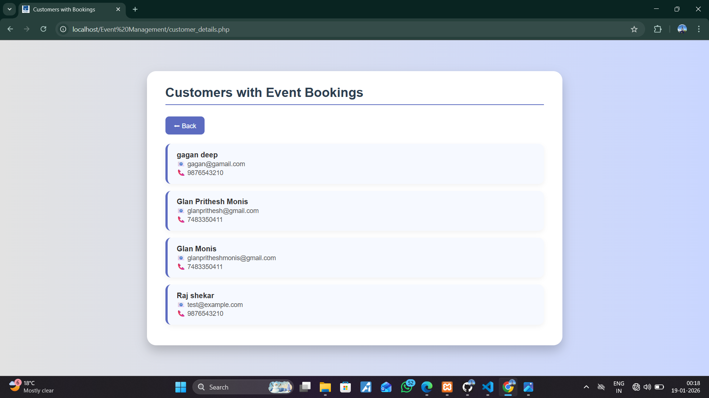

###

<h2 align="left">🚪 Logout</h2>

###

➜ Destroys the active session. ➜ Logs out both Customer and Admin users. ➜ Redirects to the Home page.

###

<h2 align="left">🗄️ Database Setup</h2>

###

The Event Management System uses MySQL as its database.

###

𝐃𝐚𝐭𝐚𝐛𝐚𝐬𝐞 𝐅𝐢𝐥𝐞

###

𝐓𝐚𝐛𝐥𝐞𝐬 𝐎𝐯𝐞𝐫𝐯𝐢𝐞𝐰: 1. customer → Stores customer information like name, email, password, and contact details. 2. decoration → Stores decoration types, optional items, and their prices. 3. bookings → Stores all booking details including customer, event, selected decorations, optional items, date, time, and total price.  How to Setup  1. Open 𝐩𝐡𝐩𝐌𝐲𝐀𝐝𝐦𝐢𝐧. 2. Create a new database (e.g., event_management). 3. Import the event_management.sql file. 4. Ensure the db_connect.php file contains the correct database name, username, and password.

###

<h3 align="left">ER Diagram</h3>

###

It is recommended to include an ER diagram to visualize relationships:  ★ customer → bookings (One-to-Many) ★ decoration → bookings (Many-to-Many via booking details)

###

. 5. Open a browser and go to:     http://localhost/Event Management/

###

<h2 align="left">📌 Conclusion</h2>

###

This Event Management System demonstrates real-world usage of PHP, MySQL, and session management, providing separate dashboards for customers and administrators. It helped me strengthen my backend development skills and understand complete project flow from UI to database.

###
